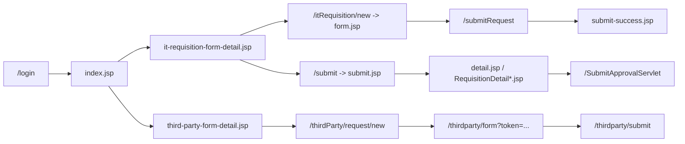

# SLF Requisition Form - Project Context

This document is a handoff file for another AI/model. It was generated by scanning the repository source tree, Java servlet/controller code, DAO/model/utility packages, JSP pages, shared JSP fragments, CSS files, SQL migrations, Maven configuration, web.xml, and unit tests.

> Do not change existing behavior casually. This is a JSP/Servlet enterprise workflow app with many route, role, and UI-structure tests that depend on existing paths, names, and page contracts.

## 1. Project Overview

### Project Name

`SLF_Requisition_Form`

The Maven artifact and WAR final name are both configured around `SLF_Requisition_Form`, which deploys locally as:

`http://localhost:8080/SLF_Requisition_Form`

### Business Purpose

This is an enterprise requisition and approval system for Student Loan Fund / SLF-style internal IT workflows. It supports:

- Internal IT service request creation.
- Multi-step approval and operational handling.
- Third-party external user registration/access request workflow through secure token links.
- Email notification logging and retry dispatch.
- Admin visibility into members, mail logs, and third-party link/submission records.

### Main Users and Roles

Important role strings are used directly throughout the code. Preserve spelling and aliases.

- `Admin`: system administration, member management, mail log, third-party admin pages.
- `Director`: first approval step for IT requisitions from requester department.
- `Technical`: technical/section-head approval and some operational inbox access.
- `ITDirector` / `IT Director`: IT director approval and final certification.
- `Infrastructure`: third-party operational/revoke/review work; IT requisition operational work where assigned.
- `Development`, `Data`, `Cyber Security`, `Research`, `Reseach`, `IT Planning`: operational roles for IT requisition process stage.
- Regular internal employees/requesters: create IT requisition forms, submit third-party link requests if allowed, view own submitted forms/history.
- External third-party users: no login; access public form/acceptance pages only through tokens.

### Main Workflows

- Login with captcha/cooldown protection.
- Form-first landing page at `index.jsp`.
- IT Requisition Request:
  requester creates form -> Director approval -> Technical approval/assignment -> IT Director approval -> Operational processing -> requester confirmation.
- Third Party Registration:
  internal owner creates token link -> external user submits form -> Technical assignment -> IT Director approval -> Infrastructure operator completes grant -> external acceptance -> revoke operator -> revoke reviewer -> Technical report -> IT Director final certification.
- Email notification queue:
  workflow events enqueue rows in `EMAIL_NOTIFICATION_LOG`; a servlet listener dispatches due rows by SMTP.

### System Architecture

Classic Java web application:

- JSP views in `src/main/webapp`.
- Java Servlets in `src/main/java/com/slf/controller`.
- DAO layer using JDBC and HikariCP in `src/main/java/com/slf/dao`.
- Models in `src/main/java/com/slf/model`.
- Filters in `src/main/java/com/slf/filter`.
- Shared utility classes in `src/main/java/com/slf/util`.
- Notification services in `src/main/java/com/slf/notification`.
- Oracle database with SQL migrations under `sql`.
- WAR deployment through Maven/Tomcat.

High-level request flow:



## 2. Technology Stack

### Languages

- Java
- JSP/JSTL
- HTML/CSS/JavaScript
- SQL/Oracle PL/SQL-style migration scripts
- Rust for captcha native artifacts under `rust/`

### Java/Web Framework

- Servlet/JSP application targeting Java EE style APIs.
- `web.xml` version 3.1.
- Most routes are annotation based with `@WebServlet`, `@WebFilter`, and `@WebListener`.
- Login routes are explicitly mapped in `src/main/webapp/WEB-INF/web.xml`.

### Build and Runtime

- Maven WAR project.
- `pom.xml` finalName: `SLF_Requisition_Form`.
- Local runtime is Tomcat 9.x.
- Build/test commands:
  - `mvn -q test`
  - `mvn -q package`

### Key Dependencies

From `pom.xml`:

- `junit:junit:3.8.1` for tests.
- `javax.servlet-api:4.0.1` and `jakarta.servlet-api:5.0.0` as provided dependencies.
- `javax.servlet:jstl:1.2`.
- `com.oracle.database.jdbc:ojdbc8:21.9.0.0`.
- `com.zaxxer:HikariCP:5.1.0`.
- `com.fasterxml.jackson.core:jackson-databind:2.17.2`.
- `com.sun.mail:javax.mail:1.6.2`.
- `org.mindrot:jbcrypt:0.4`.
- `openpdf` and `flying-saucer-pdf-openpdf` for PDF generation.

### Database

- Oracle Database.
- Connection pool: HikariCP.
- DB config file: `src/main/resources/db.properties`.
- DB config can also be overridden with:
  - `SLF_DB_URL`
  - `SLF_DB_USERNAME`
  - `SLF_DB_PASSWORD`
  - `SLF_DB_DRIVER`

### External Services

- SMTP/Gmail-style email dispatch through JavaMail.
- Config defaults to `C:\slf-secrets\gmail.properties`.
- Third-party external links use random URL-safe tokens hashed with SHA-256 in the database.
- Login captcha is generated by Java (`JavaCaptchaService`) and there are Rust captcha artifacts in `rust/` and `rust_captcha.dll`.

## 3. Folder and File Map

### Root

- `pom.xml`: Maven WAR build, dependencies, final WAR/context name.
- `rust_captcha.dll` and `lib/rust_captcha.dll`: native captcha artifacts.
- `hs_err_pid19132.log`: JVM crash log; likely not part of app behavior.
- `PROJECT_CONTEXT.md`: this handoff file.

### `src/main/java/com/slf/controller`

Servlet/controller layer.

Important IT Requisition controllers:

- `LoadLoginServlet.java`: loads login page; mapped in `web.xml`, not annotation.
- `LoginProcessorServlet.java`: validates credentials, captcha, cooldown, session creation.
- `LoadFormServlet.java`: `/itRequisition/new`, `/newForm/requisition`; loads IT requisition form.
- `SubmitRequestServlet.java`: `/submitRequest`; validates and saves IT requisition form.
- `LoadSubmitServlet.java`: `/submit`; loads submitted-form tracking list.
- `SubmitApprovalServlet.java`: `/SubmitApprovalServlet`; approval state transitions with transaction/locking.
- `LoadDirectorServlet.java`: `/directorApprove`; Director inbox.
- `LoadTechnicalServlet.java`: `/technicalApprove`; Technical inbox.
- `LoadITDirectorServlet.java`: `/itDirectorApprove`; IT Director inbox.
- `LoadProcessServlet.java`: `/process`; operational inbox.
- `ExtendDeadlineServlet.java`: `/ExtendDeadlineServlet`.
- `EditFormServlet.java`: `/editForm`.
- `ExportPDFServlet.java`: `/exportPDF`.
- `FormSelectionServlet.java`: `/newForm`, `/formSelection`.
- `FormTypeSelectionServlet.java`: `/forms/select`.

Important third-party controllers:

- `ThirdPartyRequestServlet.java`: `/thirdParty/request/new`; internal owner link-management page and create/cancel actions.
- `ThirdPartyRequestLinkServlet.java`: `/thirdParty/request/link`; generated link display.
- `ThirdPartyPublicFormServlet.java`: `/thirdparty/form`; public token validation and form display.
- `ThirdPartySubmitServlet.java`: `/thirdparty/submit`; public external form submit.
- `ThirdPartySubmissionServlet.java`: `/thirdPartySubmission`; admin/owner submission detail.
- `ThirdPartyHistoryServlet.java`: `/thirdParty/history`; third-party history/tracking.
- `ThirdPartyLinksServlet.java`: `/thirdPartyLinks`; admin link list.
- `ThirdPartySectionHeadInboxServlet.java`: `/thirdParty/sectionHead`.
- `ThirdPartySectionHeadReviewServlet.java`: `/thirdParty/sectionHead/review`.
- `ThirdPartyItDirectorInboxServlet.java`: `/thirdParty/itDirector`.
- `ThirdPartyItDirectorReviewServlet.java`: `/thirdParty/itDirector/review`.
- `ThirdPartyOperatorInboxServlet.java`: `/thirdParty/operator`.
- `ThirdPartyOperatorReviewServlet.java`: `/thirdParty/operator/review`.
- `ThirdPartyRevokerReviewServlet.java`: `/thirdParty/revoker/review`.
- `ThirdPartyRevokeReviewerReviewServlet.java`: `/thirdParty/revokeReviewer/review`.
- `ThirdPartySectionHeadReportServlet.java`: `/thirdParty/sectionHead/report`.
- `ThirdPartyFinalCertificationServlet.java`: `/thirdParty/itDirector/certify`.
- `ThirdPartyAcceptanceServlet.java`: `/thirdparty/accept`.
- `ThirdPartyAcceptanceSubmitServlet.java`: `/thirdparty/accept/submit`.
- `ThirdPartyAcceptanceExpiryListener.java`: `@WebListener`; advances expired acceptance tokens.
- `ThirdPartyExportPDFServlet.java`: `/thirdParty/exportPdf`.

Admin/support controllers:

- `MemberManageServlet.java`: `/memberManage`.
- `EmailNotificationSettingsServlet.java`: `/emailNotifications`.
- `MailLogServlet.java`: `/mailLog`.
- `LogoutServlet.java`: `/logout`.

### `src/main/java/com/slf/dao`

Database access layer.

- `DBConnection.java`: HikariCP singleton. Reads `db.properties` and environment overrides.
- `OracleRequisitionDAO.java`: inserts IT requisition form header/items/permission details/initial approval row in one transaction.
- `RequisitionDAO.java`: DAO interface for requisitions.
- `TechnicalApprovalDAO.java`: Technical inbox helper.
- `LookupDAO.java`: login lookup, employee, request types, sections/departments.
- `MemberDAO.java`: member management queries.
- `ThirdPartyRequestDAO.java`: create/cancel/read third-party request/link history.
- `ThirdPartyFormLinkDAO.java`: create/revoke/find token links.
- `ThirdPartyFormSubmissionDAO.java`: external submission transaction and detail queries.
- `ThirdPartyWorkflowDAO.java`: internal third-party workflow transitions and assignments.
- `ThirdPartyAcceptanceDAO.java`: acceptance token/result lifecycle.
- `ThirdPartyAuditLogDAO.java`: third-party audit log helper.

### `src/main/java/com/slf/model`

Plain data models:

- IT requisition: `RequisitionForm`, `RequestItem`, `RequestType`, `TechnicalApprovalForm`.
- Organization/user: `Employee`, `Department`, `Section`, `MemberProfile`.
- Email: `EmailNotificationLogEntry`.
- Third-party: `ThirdPartyRequest`, `ThirdPartyFormLink`, `ThirdPartyFormSubmission`, `ThirdPartyAccessRequest`, `ThirdPartyWorkflowAssignment`, `ThirdPartyWorkflowActionEntry`, `ThirdPartyAcceptanceToken`, `ThirdPartyAcceptanceResult`.

### `src/main/java/com/slf/filter`

- `AuthenticationFilter.java`: global session guard, public route allowlist, approval-only requester-path redirect.
- `RoleBasedAccessFilter.java`: page-key role checks for admin/approval/history/detail pages.
- `SecurityHeadersFilter.java`: security headers and CSP.

### `src/main/java/com/slf/security`

- `LoginAttemptService.java`: failure counter, captcha threshold, cooldown.
- `JavaCaptchaService.java`: SVG captcha generation and answer verification.
- `CaptchaChallenge.java`: captcha DTO.

### `src/main/java/com/slf/util`

- `AuthUtil.java`: role/page permission matrix and approval-only role helpers.
- `SecurityUtil.java`: CSRF token creation/validation and HTML escaping.
- `PasswordUtil.java`: BCrypt with legacy plaintext fallback.
- `ThirdPartyAccessPolicy.java`: third-party owner/admin visibility rules.
- `ThirdPartyLinkToken.java`: 64-byte random token generation and SHA-256 hashing.
- `NavigationUtil.java`: navigation helpers.
- `RequestMetadataUtil.java`: request IP/user-agent helpers.
- `ThirdPartyConsentContent.java`: consent/version content helpers.
- `BangkokTimeUtil.java`: timestamp/date handling.

### `src/main/java/com/slf/notification`

- `ApprovalNotificationService.java`: IT requisition event notification enqueue.
- `ApprovalNotificationRecipientResolver.java`: IT requisition recipient lookup.
- `ThirdPartyNotificationService.java`: third-party workflow notification enqueue.
- `ThirdPartyNotificationRecipientResolver.java`: third-party recipient lookup.
- `EmailNotificationLogDAO.java`: notification outbox CRUD, schema compatibility for form references.
- `EmailNotificationDispatcher.java`: claims and sends due email logs.
- `EmailNotificationWorkerListener.java`: daemon scheduled worker every 15 seconds.
- `GmailNotificationConfig.java`: SMTP config file/env loading.
- `GmailNotificationService.java`: JavaMail SMTP send implementation.
- `NotificationRecipientResolver.java`: email shape/recipient helpers.
- `NotificationSendResult.java`: sent/failed/skipped result.

### `src/main/java/com/example/crypto`

- `CryptoBridge.java`: appears to be standalone/demo crypto code. It prints to stdout and catches exceptions with stack traces. It does not appear central to the requisition workflow.

### `src/main/webapp`

Main JSP pages:

- `login.jsp`: login UI/captcha/cooldown.
- `index.jsp`: form-first main landing page.
- `it-requisition-form-detail.jsp`: IT Requisition action/detail page.
- `third-party-form-detail.jsp`: Third Party action/detail page.
- `form.jsp`: IT Requisition input page.
- `submit.jsp`: submitted IT forms/tracking page.
- `submit-success.jsp`: success after form submit.
- `history.jsp`: role-based historical IT requisition list.
- `detail.jsp`: read-only detail, often used from history.
- `DirectorApprove.jsp`, `TechnicalApprove.jsp`, `ITDirectorApprove.jsp`, `Process.jsp`: approval/operational inbox pages.
- `RequisitionDetail.jsp`, `RequisitionDetail_Comment.jsp`, `RequisitionDetail_ITDirector.jsp`, `RequisitionDetail_Process.jsp`: IT requisition approval/detail pages for stages.
- `MailLog.jsp`: email notification log.
- `EmailNotificationSettings.jsp`: profile/email notification settings.
- `MemberManage.jsp`, `Admin.jsp`, `Dashboard.jsp`: admin pages.
- `pdf.jsp`: legacy/direct PDF-style detail rendering.

Third-party JSP pages:

- `third-party-request-new.jsp`: owner link management/status page.
- `third-party-request-link.jsp`: generated link page.
- `thirdpartyForm.jsp`: external public third-party form.
- `thirdpartySubmitResult.jsp`: external submission result page.
- `thirdpartyAcceptance.jsp`: external acceptance page.
- `third-party-history.jsp`: third-party tracking/history.
- `ThirdPartySubmission.jsp`: third-party submission detail.
- `ThirdPartyLinks.jsp`: admin link management.
- `third-party-pdf.jsp`: third-party PDF view/export content.
- `WEB-INF/third-party-*.jsp`: secured internal workflow review/inbox pages.

Shared JSP fragments:

- `src/main/webapp/WEB-INF/jspf/topbar.jspf`: shared topbar/header.
- `src/main/webapp/WEB-INF/jspf/sidebar.jspf`: shared context-aware sidebar.
- `src/main/webapp/WEB-INF/jspf/footer.jspf`: shared footer.
- `src/main/webapp/WEB-INF/jspf/third-party-confirm-dialog.jspf`: shared confirmation dialog for third-party workflow.
- Legacy fragments also exist in `src/main/webapp/WEB-INF/sidebar.jsp` and `src/main/webapp/WEB-INF/sticky-bar.jsp`.

### CSS and Assets

- `src/main/webapp/css/styles.css`: broad shared design system, topbar/sidebar/footer, landing/form-detail patterns.
- `src/main/webapp/css/submit.css`: IT service request tracking/list UI.
- `src/main/webapp/css/form.css`: IT form/detail page styles.
- `src/main/webapp/css/fonts/Anuphan-VariableFont_wght.ttf`: self-hosted Anuphan font.
- `src/main/webapp/images/MoF.png`, `SLF_logo.png`, `cropped-logo-192x192.png`: institutional branding.
- `src/main/resources/fonts`: fonts for PDF rendering.

### SQL Migrations

SQL files are under `sql/`.

Important migrations:

- `2026-05-25_member_management.sql`
- `2026-06-05_email_notification_log.sql`
- `2026-06-05_email_notification_settings.sql`
- `2026-06-07_email_notification_outbox.sql`
- `2026-06-08_email_notification_ready_status.sql`
- `2026-06-08_third_party_form_links.sql`
- `2026-06-08_third_party_link_raw_token.sql`
- `2026-06-09_third_party_access_request.sql`
- `2026-06-09_third_party_request_flow.sql`
- `2026-06-09_third_party_request_link_only.sql`
- `2026-06-09_third_party_request_owner_678.sql`
- `2026-06-11_third_party_workflow.sql`
- `2026-06-11_third_party_acceptance.sql`
- `2026-06-11_third_party_workflow_finalize.sql`
- `2026-06-12_drop_third_party_submission_status.sql`
- `2026-06-12_fix_third_party_gregorian_dates.sql`
- `2026-06-12_third_party_history_indexes.sql`
- `2026-06-16_email_notification_form_reference.sql`

## 4. Request / Approval Flow - IT Requisition

### Create Flow

1. User logs in.
2. User lands on `index.jsp`.
3. User selects IT Requisition.
4. `it-requisition-form-detail.jsp` offers actions:
   - create new request via `/itRequisition/new`
   - view submitted forms via `/submit`
   - view history via `/history.jsp`
5. `LoadFormServlet` loads `form.jsp`.
6. `form.jsp` posts to `/submitRequest`.
7. `SubmitRequestServlet` validates session, role, CSRF, header fields, request type IDs, destination section, and items.
8. `OracleRequisitionDAO.save()` inserts:
   - `REQUISITIONFORM`
   - `REQUEST`
   - `PERMISSIONDETAILS` where server access applies
   - initial `APPROVALINFO` row with `STATE_STEP = 0`
9. `ApprovalNotificationService.notifyFormSubmitted()` enqueues notifications.
10. Controller redirects to `submit-success.jsp?formId=...`.

### Validation in `SubmitRequestServlet`

Server-side validation includes:

- logged-in employee required.
- valid CSRF token required.
- approval-only roles cannot submit.
- `requestTopic` required.
- `deadline` required and parseable as `YYYY-MM-DD`.
- at least one `requestType[]`.
- each request type must be integer.
- all selected request types must resolve to one common `REQUESTTYPE.SECID`.
- each item must have objective.
- item detail must be present through objective/program/other/server fields.
- server access detail requires folder and folder permissions.
- subfolder permission and subfolder name must be consistent.

### Approval States

`APPROVALINFO.STATE_STEP` is the central IT requisition workflow state.

| State | Meaning |
|---:|---|
| `0` | Waiting for requester department Director/head approval |
| `1` | Waiting for assigned Technical/section-head approval and developer assignment |
| `2` | Waiting for assigned department IT Director/head approval |
| `3` | Waiting for assigned developer/operator or assigned heads to complete work |
| `4` | Waiting for requester confirmation |
| `5` | Completed/confirmed |
| `-1` | Rejected by Director |
| `-2` | Rejected by Technical |
| `-3` | Rejected by IT Director |
| `-4` | Rejected by assigned staff/operator |
| `-5` | Rejected by requester |

### Approval Transition Servlet

`SubmitApprovalServlet` is the critical transition point.

Important behavior:

- POST only.
- Requires logged-in reviewer from session.
- Requires valid CSRF token.
- Parses `formId`, `action`, `expectedStep`, `comment`, `devEmpId`, and `redirectPage`.
- Sanitizes redirect destination to one of:
  - `directorApprove`
  - `itDirectorApprove`
  - `technicalApprove`
  - `process`
  - `submit`
- Checks role against the target approval action.
- Opens DB transaction.
- Locks target form with `SELECT FORMID FROM REQUISITIONFORM WHERE FORMID = ? FOR UPDATE`.
- Reads latest state from `APPROVALINFO`.
- Rejects stale approval if `expectedStep` is missing or no longer equals current state.
- Rejects actions on negative or completed states.
- Checks stage-specific reviewer authorization.
- Requires developer assignment when Technical approves step `1`.
- Ensures selected developer is in assigned section.
- Inserts a new `APPROVALINFO` row.
- Commits and then enqueues notifications.

### Stage Authorization

`SubmitApprovalServlet.assertAuthorized()` enforces:

- Step `0`: requester department `DEPARTMENT.DEPTHEAD_EMPID`.
- Step `1`: assigned section `SECTION.SECTIONHEAD_EMPID`.
- Step `2`: assigned section's department `DEPARTMENT.DEPTHEAD_EMPID`.
- Step `3`: latest assigned developer, assigned section head, or assigned department head.
- Step `4`: requester only.

### Technical Approval Required

`isTechnicalApprovalRequired()` currently returns `true` for all IT requisitions. It attempts to read `REQUISITIONFORM.TECHNICAL_APPROVAL_REQUIRED`, but legacy schemas without that column fall back to `true`. This prevents Director approval from skipping the Technical stage.

### Inbox/List Pages

- `/directorApprove`: latest state `0`, filtered to requester department head.
- `/technicalApprove`: latest state `1`, assigned section head logic.
- `/itDirectorApprove`: latest state `2`, assigned department head.
- `/process`: latest state `3`, assigned developer or assigned heads.
- `/submit`: current user's submitted forms; includes pending/overdue/rejected/approved filters and timeline timestamps.
- `history.jsp`: role-based history list, using latest approval state and source-specific back links.

### Data Freshness

`LoadSubmitServlet` disables browser caching:

- `Cache-Control: no-cache, no-store, must-revalidate`
- `Pragma: no-cache`
- `Expires: 0`

The submit list queries the database directly rather than relying on session-cached DTOs.

## 5. Third-Party Form / Token Flow

### Form Code

Third-party flow uses:

`THIRD_PARTY_USER_REGISTRATION`

### Internal Link Creation

Route:

`/thirdParty/request/new`

Main files:

- `ThirdPartyRequestServlet.java`
- `ThirdPartyRequestDAO.java`
- `ThirdPartyFormLinkDAO.java`
- `third-party-request-new.jsp`
- `third-party-request-link.jsp`

Flow:

1. Internal user opens third-party link management page.
2. `ThirdPartyAccessPolicy.canCreateOwnLinks()` currently only allows employee id `678`.
3. `ThirdPartyRequestDAO.createRequest()` inserts a `THIRD_PARTY_REQUEST` with:
   - `FORM_CODE = 'THIRD_PARTY_USER_REGISTRATION'`
   - `INTERNAL_OWNER_EMPID`
   - `STATUS = 'LINK_CREATED'`
4. `ThirdPartyLinkToken.generateRawToken()` generates a 64-byte URL-safe token.
5. `ThirdPartyLinkToken.sha256Hex()` hashes the raw token.
6. `ThirdPartyFormLinkDAO.createLink()` stores token hash, raw token, request id, creator, and expiry.
7. Generated link is shown to the internal owner.

Token lifetime:

- `ThirdPartyFormLinkDAO.LINK_TTL_MILLIS` is 24 hours.

### Public External Form

Routes:

- `/thirdparty/form?token=...`
- `/thirdparty/submit`

These are public routes allowed by `AuthenticationFilter`.

Flow:

1. External user opens `/thirdparty/form?token=...`.
2. `ThirdPartyPublicFormServlet` hashes token and calls `ThirdPartyFormLinkDAO.findUsableByTokenHash()`.
3. Link is usable only when effective status is `ACTIVE`, submit count is below max, no existing submission exists, and not expired/revoked/used.
4. `thirdpartyForm.jsp` renders the external form.
5. `ThirdPartySubmitServlet` validates external fields and access request rows.
6. `ThirdPartyFormSubmissionDAO.submitOnce()` transaction:
   - marks link `USED`
   - clears raw token
   - increments submit count
   - inserts `THIRD_PARTY_FORM_SUBMISSION`
   - formats document number as `TP-000000`
   - inserts `THIRD_PARTY_ACCESS_REQUEST` rows
   - updates `THIRD_PARTY_REQUEST` to `PENDING_SECTION_HEAD`
   - inserts `THIRD_PARTY_WORKFLOW_ACTION` as `EXTERNAL_SUBMITTED`
7. `ThirdPartyNotificationService.notifyExternalSubmitted()` enqueues Technical and owner notifications.

### Third-Party Validation Highlights

From controller/tests:

- Consent is required.
- Access request rows support multiple users.
- National ID is required for DSL-related systems.
- Thai national ID checksum is validated.
- English full name can be required by access request validation.
- Buddhist Era dates are normalized to Gregorian when year >= 2500.
- Access end date must not be before start date.

### Third-Party Internal Workflow

Central status column:

`THIRD_PARTY_REQUEST.STATUS`

`THIRD_PARTY_FORM_SUBMISSION` status was intentionally removed; `THIRD_PARTY_REQUEST` is the source of workflow status.

| Status | Owner/Actor | Meaning |
|---|---|---|
| `LINK_CREATED` | Internal owner | Link generated, external form not submitted |
| `PENDING_SECTION_HEAD` | Technical | Technical reviews and assigns operators/reviewer |
| `PENDING_IT_DIRECTOR` | IT Director | IT Director approves/rejects |
| `PENDING_OPERATOR` | Infrastructure grant operator | Access setup |
| `PENDING_EXTERNAL_ACCEPTANCE` | External user | External acceptance link active |
| `PENDING_REVOKER` | Infrastructure revoke operator | Access revocation |
| `PENDING_REVOKE_REVIEWER` | Infrastructure reviewer | Revocation review |
| `PENDING_SECTION_HEAD_REPORT` | Technical | Technical summary report |
| `PENDING_FINAL_CERTIFICATION` | IT Director | Final certification |
| `COMPLETED` | Workflow complete | Done |
| `REJECTED` | IT Director or workflow reviewer | Rejected |
| `CANCELLED` | Owner/admin flow | Cancelled |

### Third-Party Workflow DAO Rules

`ThirdPartyWorkflowDAO` enforces:

- Technical section head review actor must have position `Technical`.
- Grant/revoke/reviewer assignments must be active `Infrastructure` employees.
- Revoke reviewer cannot be the same as grant or revoke operator.
- IT Director decisions require active `ITDirector`/`IT Director` position logic.
- Operator/revoker/reviewer steps require assigned employee and active `Infrastructure`.
- Status transitions update only when current status matches expected status.
- Each internal transition writes `THIRD_PARTY_WORKFLOW_ACTION`.

### Third-Party Acceptance

Routes:

- `/thirdparty/accept?token=...`
- `/thirdparty/accept/submit`

After Infrastructure operator completes setup:

- `ThirdPartyWorkflowDAO.submitOperatorCompletion()` creates `THIRD_PARTY_ACCEPTANCE_TOKEN`.
- Acceptance token lifetime is 7 days.
- External acceptance writes `THIRD_PARTY_ACCEPTANCE_RESULT`.
- Expired acceptance tokens are advanced by `ThirdPartyAcceptanceExpiryListener`.

## 6. Authentication and Authorization

### Login

Routes are explicitly mapped in `web.xml`:

- `/login` -> `LoadLoginServlet`
- `/processLogin` -> `LoginProcessorServlet`

Important:

- Tests expect login servlets not to also use `@WebServlet`.
- Do not redirect to `login.jsp` directly. Use `/login`.

### Session Attributes

On successful login, `LoginProcessorServlet` sets:

- `loggedInEmpId`
- `loggedInEmpName`
- `empName`
- `position`
- `empid`

### Passwords

`PasswordUtil` supports:

- BCrypt hashes starting with `$2a$`.
- Legacy plaintext fallback during migration.

### Captcha and Cooldown

`LoginAttemptService`:

- Requires captcha after 4 failed attempts.
- Enforces cooldown after 6 failed attempts.
- Cooldown appears to be 30 seconds.
- Window is 10 minutes.

`JavaCaptchaService`:

- SVG data URL captcha.
- 5-character challenge.
- 5-minute TTL.

### AuthenticationFilter

`AuthenticationFilter` runs on `/*`.

Public allowlist:

- `/login`
- `/processLogin`
- `/thirdparty/form`
- `/thirdparty/submit`
- `/thirdparty/accept`
- `/thirdparty/accept/submit`
- `/css/*`
- `/images/*`

All other routes require session with `loggedInEmpId` or `user`.

Approval-only roles (`Director`, `ITDirector`, `IT Director`) are redirected away from requester-only paths such as:

- `/newForm`
- `/formSelection`
- `/forms/select`
- `/itRequisition/new`
- `/newForm/requisition`
- `/form.jsp`
- `/submit`
- `/submit.jsp`

### RoleBasedAccessFilter

`RoleBasedAccessFilter` guards:

- Admin pages.
- Approval list pages.
- Approval detail pages.
- History page.
- Mail log.
- Third-party admin pages.

It maps paths to `AuthUtil` page keys:

- `directorApprove`
- `technicalApprove`
- `itDirectorApprove`
- `process`
- `adminPage`
- `history`
- `dashboard`
- `memberManage`
- `mailLog`
- `thirdPartyLinks`
- `thirdPartySubmission`
- `requisitionDetail`

### AuthUtil Page Permissions

Important page-role rules:

- `directorApprove`: `Admin`, `Director`.
- `technicalApprove`: `Admin`, `Technical`.
- `itDirectorApprove`: `Admin`, `ITDirector`, `IT Director`.
- `process`: `Admin`, `Technical`, `Development`, `Data`, `Infrastructure`, `Cyber Security`, `Research`, `Reseach`, `IT Planning`.
- `adminPage`, `dashboard`, `memberManage`, `mailLog`, `thirdPartyLinks`, `thirdPartySubmission`, `thirdPartyHistory`: admin-focused.
- `history`: currently returns `true` for any non-null position due a special case, even though `PAGE_ROLES` also contains admin/workflow roles.

### Security Headers

`SecurityHeadersFilter` sets:

- `Strict-Transport-Security`
- `X-Frame-Options: DENY`
- `X-Content-Type-Options: nosniff`
- `Content-Security-Policy`

CSP currently allows:

- self resources
- inline script/style
- cdnjs/jsdelivr/flaticon for CSS/font/script
- data images/fonts

### CSRF

`SecurityUtil` uses session key:

`slfCsrfToken`

Methods:

- `ensureCsrfToken(HttpServletRequest)`
- `isValidCsrfToken(HttpServletRequest)`

Important POST routes using CSRF include:

- `/submitRequest`
- `/SubmitApprovalServlet`
- `/ExtendDeadlineServlet` if implemented consistently in page/controller.

### XSS / HTML Escaping

`SecurityUtil.escapeHtml(Object)` exists and is used in several JSPs. Some older JSP scriptlets still need careful review before adding new user/DB output.

### IDOR-Sensitive Areas

Preserve and re-check ownership/role checks around:

- `/submitRequest` rejected-form edit flow.
- `/SubmitApprovalServlet` reviewer authorization.
- `/submit` own forms list.
- `detail.jsp?id=...` and `RequisitionDetail*.jsp?id=...`.
- `/thirdParty/request/link?requestId=...&linkId=...`.
- `/thirdPartySubmission?submissionId=...`.
- `/thirdParty/history`.
- Public token routes.

## 7. Database Summary

### Core Organization Tables

Inferred from DAO/query usage:

#### `EMPLOYEE`

Important columns:

- `EMPID`
- `EMPNAME`
- `POSITION`
- `SECID`
- `PHONE`
- `PASSWORD`
- `IS_ACTIVE`
- `EMAIL`
- `EMAIL_NOTIFICATION_ENABLED`

Relationships:

- `EMPLOYEE.SECID` -> `SECTION.SECID`.
- Used by login, role checks, notifications, assignments.

#### `SECTION`

Important columns:

- `SECID`
- `SECNAME`
- `DEPTID`
- `SECTIONHEAD_EMPID`

Relationships:

- `SECTION.DEPTID` -> `DEPARTMENT.DEPTID`.
- `SECTION.SECTIONHEAD_EMPID` -> `EMPLOYEE.EMPID`.

#### `DEPARTMENT`

Important columns:

- `DEPTID`
- `DEPTNAME`
- `DEPTHEAD_EMPID`

Relationships:

- `DEPARTMENT.DEPTHEAD_EMPID` -> `EMPLOYEE.EMPID`.

### IT Requisition Tables

#### `REQUISITIONFORM`

Important columns:

- `FORMID`
- `EMPID`
- `TITLEFORM`
- `REQUESTDATE`
- `DEADLINE`
- `ASSIGN_SECID`
- `IS_EDITED`
- optional legacy/new column `TECHNICAL_APPROVAL_REQUIRED`

Relationships:

- `EMPID` -> requester `EMPLOYEE.EMPID`.
- `ASSIGN_SECID` -> `SECTION.SECID`.
- `FORMID` referenced by `REQUEST`, `APPROVALINFO`, `PERMISSIONDETAILS`, email logs.

#### `REQUEST`

Important columns:

- `TYPEID`
- `FORMID`
- `OTHERDETAILS_OR_PROGRAM`
- `DETAILOBJECTIVE`
- `CURRENTMETHOD`

Relationships:

- `TYPEID` -> `REQUESTTYPE.TYPEID`.
- `FORMID` -> `REQUISITIONFORM.FORMID`.

#### `REQUESTTYPE`

Important columns from code usage:

- `TYPEID`
- `SECID`

Purpose:

- Maps selected request type to responsible IT section.
- `SubmitRequestServlet.resolveAssignedSecId()` requires all selected request types to belong to the same `SECID`.

#### `PERMISSIONDETAILS`

Important columns:

- `FORMID`
- `ISROOT`
- `PATH`
- `HASFULLCONTROL`
- `HASMODIFY`
- `HASREADEXECUTE`
- `HASREAD`
- `HASWRITE`

Purpose:

- Stores server/folder/subfolder access permissions for server access request items.

#### `APPROVALINFO`

Important columns:

- `APPROVALID`
- `STATE_STEP`
- `FORMID`
- `REVIEWER_EMPID`
- `DEV_EMPID`
- `IT_COMMENT`
- `APPROVED_DATE`

Purpose:

- Append-only-ish approval state history.
- Latest row by highest `APPROVALID` is current workflow state.

### Email Tables

#### `EMAIL_NOTIFICATION_LOG`

Important columns:

- `EMAIL_LOG_ID`
- `FORM_TYPE`
- `REFERENCE_ID`
- `FORMID`
- `APPROVALID`
- `EVENT_TYPE`
- `RECIPIENT_EMPID`
- `RECIPIENT_EMAIL`
- `SUBJECT`
- `BODY`
- `STATUS`
- `SEND_ATTEMPT`
- `DEDUPE_KEY`
- `CREATED_BY`
- `CREATED_AT`
- `LAST_ATTEMPT_AT`
- `NEXT_ATTEMPT_AT`
- `SENT_AT`
- `ERROR_MESSAGE`

Statuses:

- `READY`
- `PENDING`
- `SENDING`
- `SENT`
- `FAILED`
- `SKIPPED`

Important indexes/constraints:

- unique `DEDUPE_KEY`
- status/due indexes
- `IX_EMAIL_NOTI_LOG_FORM_REF (FORM_TYPE, REFERENCE_ID)`

### Third-Party Tables

#### `THIRD_PARTY_REQUEST`

Important columns:

- `REQUEST_ID`
- `FORM_CODE`
- `INTERNAL_OWNER_EMPID`
- `EXTERNAL_COMPANY_NAME`
- `EXTERNAL_CONTACT_NAME`
- `EXTERNAL_EMAIL`
- `EXTERNAL_PHONE`
- `PURPOSE`
- `TARGET_SYSTEM`
- `ACCESS_START_DATE`
- `ACCESS_END_DATE`
- `STATUS`
- `CREATED_AT`
- `SUBMITTED_AT`
- `UPDATED_AT`

Purpose:

- Main third-party workflow state table.

#### `THIRD_PARTY_FORM_LINK`

Important columns:

- `LINK_ID`
- `TOKEN_HASH`
- `RAW_TOKEN`
- `STATUS`
- `MAX_SUBMIT_COUNT`
- `SUBMIT_COUNT`
- `CREATED_BY`
- `FORM_CODE`
- `REQUEST_ID`
- `CREATED_BY_EMPID`
- `CREATED_AT`
- `EXPIRES_AT`
- `USED_AT`
- `REVOKED_AT`
- `REVOKED_BY`
- `NOTE`

Statuses:

- `ACTIVE`
- `USED`
- `EXPIRED`
- `REVOKED`

#### `THIRD_PARTY_FORM_SUBMISSION`

Important columns:

- `SUBMISSION_ID`
- `LINK_ID`
- `DOCUMENT_RECEIVE_NO`
- `FULL_NAME_TH`
- `FULL_NAME_EN`
- `ORGANIZATION`
- `PHONE`
- `EMAIL`
- `REASON_OBJECTIVE`
- `PROJECT_NAME`
- `ACCESS_START_DATE`
- `ACCESS_END_DATE`
- consent metadata
- review/import/internal note fields

#### `THIRD_PARTY_ACCESS_REQUEST`

Important columns:

- `ACCESS_REQUEST_ID`
- `SUBMISSION_ID`
- `DISPLAY_ORDER`
- `EMPLOYEE_CODE`
- `USERNAME`
- `NATIONAL_ID`
- `FULL_NAME_TH`
- `FULL_NAME_EN`
- `POSITION_NAME`
- `MOBILE_PHONE`
- `DEPARTMENT_NAME`
- `EMAIL`
- `SYSTEM_NAME`
- `REQUESTED_ROLE`

#### `THIRD_PARTY_WORKFLOW_ASSIGNMENT`

Important columns:

- `ASSIGNMENT_ID`
- `REQUEST_ID`
- `ASSIGNMENT_ROLE`
- `ASSIGNED_EMPID`
- `ASSIGNED_BY_EMPID`
- `ASSIGNED_AT`

Allowed roles:

- `GRANT_OPERATOR`
- `REVOKE_OPERATOR`
- `REVOKE_REVIEWER`

#### `THIRD_PARTY_WORKFLOW_ACTION`

Important columns:

- `ACTION_ID`
- `REQUEST_ID`
- `ACTION_TYPE`
- `FROM_STATUS`
- `TO_STATUS`
- `ACTOR_TYPE`
- `ACTOR_EMPID`
- `COMMENT_TEXT`
- `ACTED_AT`

Important action types:

- `WORKFLOW_MIGRATED`
- `EXTERNAL_SUBMITTED`
- `SECTION_HEAD_SUBMITTED`
- `IT_DIRECTOR_APPROVED`
- `IT_DIRECTOR_REJECTED`
- `OPERATOR_COMPLETED`
- `EXTERNAL_ACCEPTED`
- `EXTERNAL_REJECTED`
- `EXTERNAL_ACCEPTANCE_EXPIRED`
- `REVOKER_COMPLETED`
- `REVOKE_REVIEWER_APPROVED`
- `REVOKE_REVIEWER_REJECTED`
- `SECTION_HEAD_REPORTED`
- `FINAL_CERTIFIED`

#### `THIRD_PARTY_ACCEPTANCE_TOKEN`

Important columns:

- `ACCEPTANCE_TOKEN_ID`
- `REQUEST_ID`
- `TOKEN_HASH`
- `RAW_TOKEN`
- `STATUS`
- `CREATED_AT`
- `EXPIRES_AT`
- `USED_AT`

#### `THIRD_PARTY_ACCEPTANCE_RESULT`

Important columns:

- `ACCEPTANCE_RESULT_ID`
- `REQUEST_ID`
- `COMMENT_TEXT`
- `SATISFACTION_LEVEL`
- `SUBMITTED_AT`

#### `THIRD_PARTY_AUDIT_LOG`

Important columns inferred from migration/DAO:

- `AUDIT_ID`
- `EVENT_TYPE`
- `REQUEST_ID`
- `LINK_ID`
- `ACTOR_EMPID`
- `ACTOR_TYPE`
- `DESCRIPTION`
- `CREATED_AT`

### Schema Assumptions and Risks

- The app uses Oracle syntax such as `FETCH FIRST`, `OFFSET ... FETCH`, identity columns, and `SYSTIMESTAMP`.
- `2026-06-09_third_party_request_owner_678.sql` enforces/reflects a hard owner assumption around employee `678`. This is likely classroom/demo-specific and should not be generalized without changing policy/tests.
- `EMAIL_NOTIFICATION_LOG.FORM_TYPE` and `REFERENCE_ID` are required for clean third-party email log support. `EmailNotificationLogDAO` has fallback behavior for legacy schemas, but third-party filtering/enqueue is limited if columns are missing.
- `web.xml` display-name is still `MyFirstJSP`, which does not match the current project identity.

## 8. Email / Notification System

### Design

Notifications are outbox based.

1. Workflow service resolves recipients.
2. Service inserts rows into `EMAIL_NOTIFICATION_LOG` with dedupe key.
3. `EmailNotificationWorkerListener` starts a background daemon.
4. `EmailNotificationDispatcher` claims due rows and sends by SMTP.
5. Log row becomes `SENT`, `SKIPPED`, `READY` for retry, or `FAILED`.

### Worker Behavior

`EmailNotificationWorkerListener`:

- Starts 2 seconds after webapp startup.
- Runs every 15 seconds.
- Uses one daemon thread named `slf-email-notification-worker`.

`EmailNotificationDispatcher`:

- Batch size: 20.
- Max attempts: 5.
- Reclaims stuck `SENDING` rows older than 10 minutes.
- Retry delay is exponential backoff:
  - 1 minute
  - 2 minutes
  - 4 minutes
  - capped at 1 hour

### SMTP Config

Default file:

`C:\slf-secrets\gmail.properties`

Supported properties/environment:

- `slf.mail.enabled` / `SLF_MAIL_ENABLED`
- `slf.mail.host` / `SLF_MAIL_HOST`
- `slf.mail.port` / `SLF_MAIL_PORT`
- `slf.mail.ssl` / `SLF_MAIL_SSL`
- `slf.mail.username` / `SLF_MAIL_USERNAME`
- `slf.mail.password` / `SLF_MAIL_PASSWORD`
- `slf.mail.from` / `SLF_MAIL_FROM`
- `slf.mail.to` / `SLF_MAIL_TO`

Legacy aliases:

- `slf.gmail.enabled` / `SLF_GMAIL_ENABLED`
- `slf.gmail.sender` / `SLF_GMAIL_SENDER`
- `slf.gmail.to` / `SLF_GMAIL_TO`

Default SMTP:

- host: `smtp.gmail.com`
- port: `587`
- TLS required unless SSL port 465 is used.
- Timeouts:
  - connection 10s
  - read/write 15s

### IT Requisition Notification Events

`ApprovalNotificationService` events:

- `FORM_SUBMITTED`
- `APPROVAL_NEXT_STEP`
- `APPROVAL_REJECTED`
- `WORK_COMPLETED`
- `REQUESTER_CONFIRMED`

Recipients are resolved through `ApprovalNotificationRecipientResolver`, including:

- requester
- initial Director
- next approver
- assigned developer

Recipient lookup respects email shape and, where schema supports it, active/email-notification settings.

### Third-Party Notification Events

`ThirdPartyNotificationService` uses:

- `FORM_TYPE = THIRD_PARTY`
- `REFERENCE_ID = requestId`
- `FORMID = 0` placeholder

Events:

- `THIRD_PARTY_SUBMITTED`
- `THIRD_PARTY_SECTION_HEAD_SUBMITTED`
- `THIRD_PARTY_IT_DIRECTOR_APPROVED`
- `THIRD_PARTY_IT_DIRECTOR_REJECTED`
- `THIRD_PARTY_OPERATOR_COMPLETED`
- `THIRD_PARTY_EXTERNAL_ACCEPTED`
- `THIRD_PARTY_ACCEPTANCE_EXPIRED`
- `THIRD_PARTY_REVOKER_COMPLETED`
- `THIRD_PARTY_REVOKE_REVIEWED`
- `THIRD_PARTY_SECTION_HEAD_REPORTED`
- `THIRD_PARTY_COMPLETED`

### Mail Log UI

Route:

`/mailLog`

Files:

- `MailLogServlet.java`
- `MailLog.jsp`
- `EmailNotificationLogDAO.java`

Filters:

- `status`: `READY`, `PENDING`, `SENDING`, `SENT`, `FAILED`, `SKIPPED`, or all.
- `formType`: `REQUISITION`, `THIRD_PARTY`, or all.
- pagination with page size 50.

### Known Email Risks

- If SMTP username/password/from are missing, dispatcher marks rows failed with a config message.
- Third-party email logging depends on `FORM_TYPE`/`REFERENCE_ID` columns. Legacy schema fallback exists but may skip or hide third-party rows.
- `ThirdPartyNotificationService.notifyOperatorCompleted()` includes the raw acceptance token in body text as `Acceptance link token: ...`; it does not obviously build a full acceptance URL in that method.
- Email failure should not block core workflow because enqueue/send exceptions are logged/skipped outside core transition success paths.

## 9. UI / UX Structure

### Overall Layout Pattern

Modernized pages use:

- shared topbar: `WEB-INF/jspf/topbar.jspf`
- shared sidebar: `WEB-INF/jspf/sidebar.jspf`
- shared footer: `WEB-INF/jspf/footer.jspf`
- `styles.css` for shell/layout/design tokens.
- feature CSS such as `submit.css` and `form.css`.

Topbar includes:

- menu button
- MoF and SLF logos
- system name
- user badge
- role badge

Sidebar is context-aware:

- index/profile: main and profile/logout.
- IT flow: submitted forms, process if allowed.
- approval detail: approval/process links depending on role.
- third-party flow: third-party links/history when allowed.
- admin: collapsible admin menu.

Footer:

- `SLF Requisition Form`
- `Internal Use Only`
- `© 2026 Student Loan Fund`
- `v1.0.0`

### Main Navigation

`index.jsp` is a form-selection landing page, not a dashboard.

Current form cards:

- IT Requisition / `ใบขอให้ดำเนินการด้านเทคโนโลยีสารสนเทศ`
- Third Party Registration / external provider registration form

IT form detail page:

- `it-requisition-form-detail.jsp`
- create new request
- submitted forms
- history/tracking

Third-party detail page:

- `third-party-form-detail.jsp`
- owner/admin flows into third-party link management/history depending on role/policy.

### Back Button / Navigation Pattern

Important expectations from tests and prior UI work:

- submit list back button should return to `it-requisition-form-detail.jsp`.
- `detail.jsp?id=...&from=history` should return to history.
- `RequisitionDetail*.jsp` back behavior should preserve source context.
- Third-party submission back links should use authorized servlet destinations.
- Avoid hardcoded `localhost` URLs; use `${pageContext.request.contextPath}`.

### Do Not Duplicate Shared Chrome

Do not copy/paste topbar/sidebar HTML into pages. Prefer:

```jsp
<%@ include file="/WEB-INF/jspf/topbar.jspf" %>
<%@ include file="/WEB-INF/jspf/sidebar.jspf" %>
<%@ include file="/WEB-INF/jspf/footer.jspf" %>
```

### UI Test Sensitivity

Many tests assert specific JSP content, classes, routes, and shared-fragment usage. When changing UI:

- preserve form `action`, `method`, `name`, and hidden parameter names.
- preserve route hrefs.
- preserve security includes.
- preserve role checks.
- preserve shared component includes.

## 10. Tests

Tests use JUnit 3 `TestCase` classes under `src/test/java`.

Run:

`mvn -q test`

### Controller Tests

- `ItRequisitionDataFreshnessTest`: submit list disables browser cache/reloads DB; submit/detail pages opt out of bfcache.
- `LoadITDirectorServletTest`: IT Director inbox filters by assigned department head.
- `LoadProcessServletTest`: process inbox filters by assigned developer or assigned heads.
- `LoginProcessorServletTest`: successful login redirects to index for every role.
- `MailLogServletTest`: status/formType/page normalization.
- `SubmitApprovalServletTest`: stale approval detection, expected step parsing, redirect allowlist, reviewer matching, requester matching, operational-stage reviewer rules, missing column fallback.
- `ThirdPartyAcceptanceSubmitServletTest`: acceptance comment/satisfaction validation.
- `ThirdPartyAssignedCompletionReviewServletTest`: detail required/trimmed.
- `ThirdPartyFinalStageReviewServletTest`: final report required/trimmed.
- `ThirdPartyHistoryServletTest`: page/filter/search normalization.
- `ThirdPartyItDirectorReviewServletTest`: IT Director aliases and decision comment.
- `ThirdPartyOperatorReviewServletTest`: Infrastructure-only/operator detail validation.
- `ThirdPartySectionHeadReviewServletTest`: Technical-only and reviewer/operator separation.
- `ThirdPartySubmissionServletTest`: submission id parsing.
- `ThirdPartySubmitServletTest`: access request validation, national ID, Buddhist Era dates.

### DAO Tests

- `MemberDAOTest`: member filters, active column, default positions.
- `ThirdPartyAcceptanceExpiryTest`: expired acceptance advances workflow and writes action.
- `ThirdPartyAcceptanceRepairTest`: repairs pending external acceptance without token.
- `ThirdPartyFormLinkDAOTest`: action normalization.
- `ThirdPartyFormSubmissionDAOTest`: document number formatting and detail projection.
- `ThirdPartyGregorianDateTest`: no Calendar passed to Oracle JDBC for third-party dates.
- `ThirdPartyRequestDeletionTest`: cancel deletes only unused owned request/link.
- `ThirdPartySubmissionStatusRemovalTest`: request status is only workflow status.
- `ThirdPartyWorkflowStatusTest`: external submission enters section-head workflow and migration/status SQL expectations.

### Filter/Security/Util Tests

- `AuthenticationFilterTest`: requester-only paths, authenticated session, public third-party form access.
- `SecurityHeadersFilterTest`: security headers.
- `AuthUtilTest`: role/page permissions, approval-only roles, process access.
- `LoginAttemptServiceTest`: captcha threshold, cooldown, reset after success.
- `PasswordUtilTest`: legacy plaintext fallback.
- `ThirdPartyAccessPolicyTest`: owner/admin third-party permissions.
- `ThirdPartyLinkTokenTest`: 64-byte token and stable SHA-256 hash.

### Notification Tests

- `ApprovalNotificationServiceTest`: step text, subject/body, enqueue behavior.
- `EmailNotificationDispatcherTest`: retry backoff.
- `EmailNotificationLogDAOTest`: truncation, duplicate key, legacy schema select expressions, count SQL.
- `GmailNotificationConfigTest`: defaults, config requirements, file settings, SSL on 465.
- `GmailNotificationServiceTest`: submitted notification text and missing password failure.
- `NotificationRecipientResolverTest`: email-shape validation.
- `ThirdPartyNotificationServiceTest`: third-party recipient/event enqueue behavior.

### Webapp/JSP Structure Tests

- `AdminNavigationThaiLabelsTest`: shared admin navigation fragments and sidebar behavior.
- `AdminThirdPartyLinksPageTest`: third-party admin card layout/filters.
- `ApprovalListConsistencyTest`: approval pages use shared template; history uses current nav fragments.
- `ApprovalOnlyHomePageTest`: form-first navigation without weakening approval-only guards.
- `DesignSystemFoundationTest`: design tokens, reusable components, accessible landmarks/focus.
- `DetailBackNavigationTest`: detail returns to known source page.
- `DirectorApprovePageTest`: Director page home/history navigation.
- `FormPageUxStructureTest`: IT form page section structure and CSS contract.
- `IndexInstitutionalBannerTest`: index banner structure.
- `JspScriptletVariableTest`: checkAuth/sidebar variable namespacing.
- `ListQueueUxStructureTest`: submit/history/approval list UI structure.
- `LoginCustomCaptchaPageTest`: conditional Java captcha.
- `LoginPageIconAndCountdownTest`: local SVG icons and cooldown countdown.
- `LoginPagePerformanceTest`: login page does not block on external assets.
- `LoginRouteConsistencyTest`: no redirect to `login.jsp`.
- `LoginServletMappingTest`: login routes explicitly mapped in `web.xml`.
- `MailLogFormReferenceTest`: form-type-aware mail log reference display.
- `MemberManageEmailColumnTest`: member table hides email but edit keeps it.
- `ProjectFontTest`: self-hosted Anuphan font.
- `RoleWorkflowIndexTest`: role workflow entrances on index.
- `SubmitPageBackNavigationTest`: submit page back button route.
- `SubmitSuccessPageTest`: create-new request link route.
- `ThirdParty*Page/Test` classes: third-party UI, navigation, workflow confirm dialog, PDF, history, operator, final stage, consent, acceptance.
- `WarContextPathTest`: WAR final name/context path.

### Fragile Test Areas

- Login route mapping in `web.xml`.
- Exact servlet paths and JSP hrefs.
- Shared topbar/sidebar/footer include usage.
- CSS class names/design-token presence.
- Thai label text and escaped entity usage.
- Third-party workflow status/action strings.
- Approval state numbers.
- Mail log status/form type values.

## 11. Known Problems / TODOs / Technical Debt

Do not fix these unless explicitly asked.

### Encoding / Mojibake

Many source files contain mojibake Thai text in comments, labels, and some user-facing messages. Examples appear in:

- `src/main/java/com/slf/controller/SubmitRequestServlet.java`
- `src/main/java/com/slf/util/AuthUtil.java`
- `src/main/java/com/slf/filter/AuthenticationFilter.java`
- `src/main/webapp/WEB-INF/jspf/topbar.jspf`
- `src/main/webapp/WEB-INF/jspf/sidebar.jspf`
- SQL consent seed text

Changing these can break text-sensitive tests or UI snapshots if done casually.

### Credentials / Configuration

`src/main/resources/db.properties` contains database connection values in the repository. Future production hardening should move secrets fully to environment/external config.

### Legacy Names

`web.xml` still uses:

`<display-name>MyFirstJSP</display-name>`

This is legacy naming and does not match current project identity.

### Servlet API Dependency Ambiguity

`pom.xml` includes both:

- `jakarta.servlet-api:5.0.0`
- `javax.servlet-api:4.0.1`

The app code uses `javax.servlet.*` and Tomcat 9. Future upgrades should rationalize this carefully.

### Raw Logging / Stack Traces

Visible `printStackTrace()` / `System.out.println()` / `System.err.println()` usage exists in:

- `history.jsp`
- `pdf.jsp`
- `RequisitionDetail*.jsp`
- `OracleRequisitionDAO.java`
- `ApprovalNotificationService.java`
- `ThirdPartyNotificationService.java`
- `EmailNotificationDispatcher.java`
- `GmailNotificationConfig.java`
- `CryptoBridge.java`

Some logs are harmless development output; others may leak operational details in server logs.

### Third-Party Owner Hardcoding

`ThirdPartyAccessPolicy.INTERNAL_LINK_CREATOR_EMPID = 678`.

Migration `2026-06-09_third_party_request_owner_678.sql` also references owner `678`. This is likely project/demo-specific. Expanding third-party creation to more internal users requires coordinated policy, tests, and possibly DB constraint changes.

### Third-Party Acceptance Email

`ThirdPartyNotificationService.notifyOperatorCompleted()` sends an acceptance token text, not obviously a complete `/thirdparty/accept?token=...` URL. Check email UX before relying on it in production.

### AuthUtil History Special Case

`AuthUtil.isAllowedForPage(position, "history")` returns true for any non-null position, regardless of `PAGE_ROLES`. This may be intentional for broad history access, but it contradicts the static role map and should be treated carefully.

### Third-Party Email Schema Dependency

Third-party mail log support is best with `EMAIL_NOTIFICATION_LOG.FORM_TYPE` and `REFERENCE_ID`. If migration `2026-06-16_email_notification_form_reference.sql` is not applied, third-party enqueue/filter behavior degrades.

### Error UX

Some servlets use `sendError()` with raw English/internal messages. JSP scriptlet pages may throw `ServletException` with DB error text. User-friendly centralized error pages are not obvious.

### `CryptoBridge`

`src/main/java/com/example/crypto/CryptoBridge.java` appears detached from the main SLF package and prints demo crypto output. Verify before deleting or integrating.

## 12. How Another AI Should Continue

### High-Priority Rules

Do not change these unless the task explicitly requires it:

- Servlet paths:
  - `/login`
  - `/processLogin`
  - `/itRequisition/new`
  - `/submitRequest`
  - `/submit`
  - `/SubmitApprovalServlet`
  - `/directorApprove`
  - `/technicalApprove`
  - `/itDirectorApprove`
  - `/process`
  - `/thirdParty/request/new`
  - `/thirdparty/form`
  - `/thirdparty/submit`
  - third-party workflow paths under `/thirdParty/...`
- Form parameter names:
  - `csrfToken`
  - `formId`
  - `expectedStep`
  - `redirectPage`
  - `devEmpId`
  - `requestType[]`
  - `objective[]`
  - permission array names in `form.jsp`.
- Session attributes:
  - `loggedInEmpId`
  - `loggedInEmpName`
  - `empName`
  - `position`
  - `empid`
- Approval state numbers and meanings.
- Third-party status strings and action types.
- Shared include paths:
  - `/WEB-INF/jspf/topbar.jspf`
  - `/WEB-INF/jspf/sidebar.jspf`
  - `/WEB-INF/jspf/footer.jspf`
- Login routes must stay `/login`, not `login.jsp`.
- WAR final name/context path must remain `SLF_Requisition_Form` unless all deployment/test expectations change.

### Recommended Workflow for Future Changes

1. Inspect tests before changing routes/JSP structure.
2. Prefer small incremental changes.
3. Preserve security filters and explicit servlet role checks.
4. For approval changes, check both:
   - `SubmitApprovalServlet.java`
   - inbox loader servlet for the relevant stage
5. For third-party workflow changes, check:
   - `ThirdPartyWorkflowDAO.java`
   - corresponding servlet
   - `ThirdPartyNotificationService.java`
   - JSP page under `WEB-INF`
   - tests for status/action strings.
6. For email issues, inspect:
   - `EmailNotificationLogDAO.java`
   - `EmailNotificationDispatcher.java`
   - `GmailNotificationConfig.java`
   - `GmailNotificationService.java`
   - mail log rows in DB.
7. Run `mvn -q test` after changes.
8. If packaging/deploying locally:
   - run `mvn -q package`
   - deploy `target/SLF_Requisition_Form.war` to Tomcat 9.

### Security Checklist for Future AI Agents

Before modifying protected routes:

- Verify session checks exist.
- Verify role checks exist in servlet, not only filter, for state-changing operations.
- Verify CSRF token on POST.
- Verify IDOR/ownership check for any `id`, `formId`, `requestId`, `linkId`, `submissionId`.
- Verify all DB/user output in JSP is escaped.
- Use `PreparedStatement`; do not concatenate user input into SQL.
- Do not expose raw token hashes or sensitive internal employee data to external users.
- Do not weaken `AuthenticationFilter` public allowlist.

### Useful Commands

```powershell
mvn -q test
mvn -q package
rg --files
rg -n "@WebServlet|@WebFilter|@WebListener" src/main/java
rg -n "STATE_STEP|PENDING_|THIRD_PARTY_|EMAIL_NOTIFICATION_LOG" src sql
```

### Good Starting Points by Task Type

- Login/captcha: `LoginProcessorServlet.java`, `LoginAttemptService.java`, `JavaCaptchaService.java`, `login.jsp`.
- IT form validation: `SubmitRequestServlet.java`, `form.jsp`, `OracleRequisitionDAO.java`.
- IT workflow approval: `SubmitApprovalServlet.java`, `Load*Servlet.java`, `RequisitionDetail*.jsp`.
- Submit/history UI: `LoadSubmitServlet.java`, `submit.jsp`, `submit.css`, `history.jsp`.
- Third-party link generation: `ThirdPartyRequestServlet.java`, `ThirdPartyFormLinkDAO.java`, `ThirdPartyLinkToken.java`, `third-party-request-new.jsp`.
- Third-party public form: `ThirdPartyPublicFormServlet.java`, `ThirdPartySubmitServlet.java`, `thirdpartyForm.jsp`.
- Third-party internal workflow: `ThirdPartyWorkflowDAO.java`, `ThirdParty*ReviewServlet.java`, `WEB-INF/third-party-*.jsp`.
- Email notification: `ApprovalNotificationService.java`, `ThirdPartyNotificationService.java`, `EmailNotificationLogDAO.java`, `EmailNotificationDispatcher.java`, `GmailNotificationService.java`.
- Shared layout: `topbar.jspf`, `sidebar.jspf`, `footer.jspf`, `styles.css`.

## Final Notes

This project is route- and state-string-sensitive. The tests are a valuable executable specification for:

- route contracts,
- role visibility,
- UI structure,
- workflow state transitions,
- notification behavior,
- third-party token security.

Future work should preserve existing user flows first, then improve internals in small verified steps.
